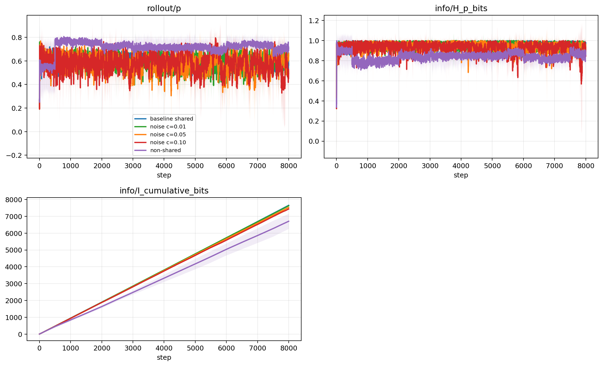
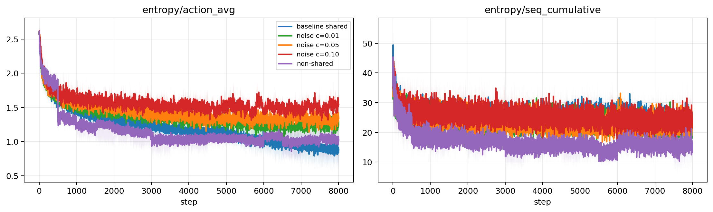
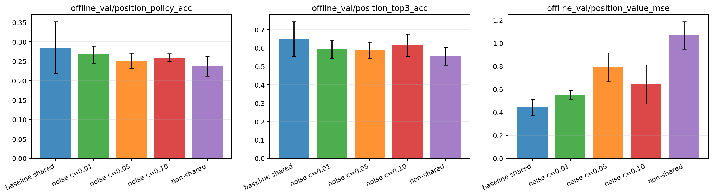
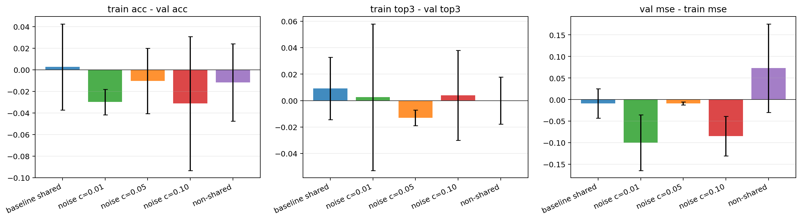
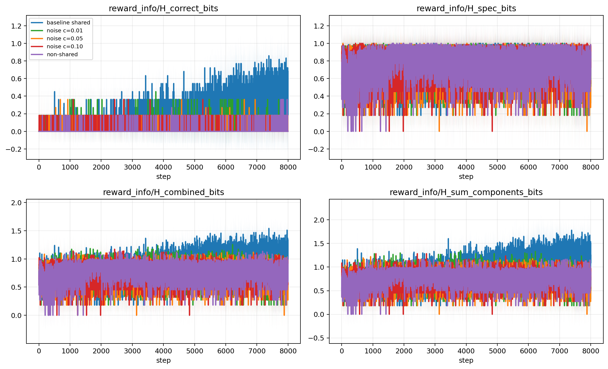
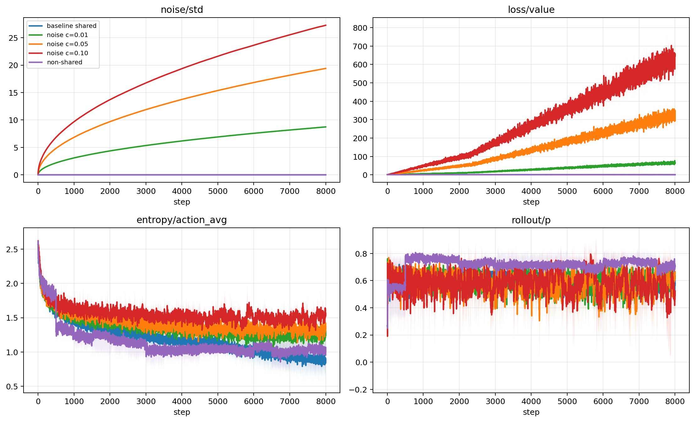
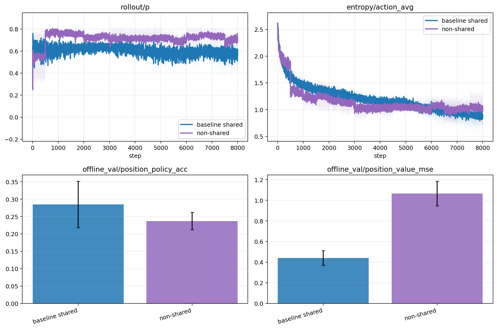

# Matrix 分析报告

本报告分析 `runs/` 下 15 个正式 Connect4 fast matrix run：5 个设置，每个设置 3 个 seed。训练时 `success_rate` 作为辅助参考；主要 performance 口径使用离线 fixed-position evaluation。

## 数据与 caveat

- 正式分组：`baseline`, `noise_c001`, `noise_c005`, `noise_c010`, `nonshared`。
- 每组 seed：0, 1, 2。
- 离线 fixed-position labels 来自 depth=4 alpha-beta negamax + heuristic，不是完美 solver。
- 当前任务是 Connect4 RLVR/AlphaZero 原型，不是 Coding Agent RLVR。

## 1. rollout=32 的 p/H/I

baseline 末步 `rollout/p` 为 0.5643 +/- 0.0785，`H_p_bits` 为 0.9760 +/- 0.0194，`I_cumulative_bits` 为 7652.2489 +/- 75.4559。non-shared 的 `rollout/p` 为 0.7093 +/- 0.0638，通常更高，但累计信息量不一定更高，说明自博弈参数共享方式改变了访问分布和策略集中程度。

## 2. action entropy 和 sequence cumulative entropy

baseline 末步 action entropy 为 0.8487 +/- 0.2428，sequence cumulative entropy 为 23.8930 +/- 5.0340。non-shared action entropy 为 1.0242 +/- 0.2249，但 sequence cumulative entropy 更低，提示 episode 轨迹分布更集中或有效长度更短。noise 组需要结合 reward noise 与 value loss 一起看，不能只用 entropy 判断 performance。

## 3. train/validation performance

离线 validation 上，policy acc 最好的是 `baseline`（0.2852），top3 acc 最好的是 `baseline`（0.6484），value MSE 最低的是 `baseline`（0.4415）。训练中的 `train/success_rate` / `val/success_rate` 多数 run 已接近或达到饱和，因此这里只作为辅助指标。

train/validation gap 图显示固定局面上的泛化差异并不完全等同于 self-play success rate。policy acc gap 接近 0 时更可信；value MSE gap 为正表示 validation value 拟合更差。

## 4. combination reward 信息量

baseline 末步 `H_combined_bits` 为 1.3344 +/- 0.0617，`H_sum_components_bits` 为 1.4980 +/- 0.0000，二者差值为 0.1636 +/- 0.0617。这个差值可以作为 correctness/spec 组件相关性或冗余的线索；差值越大，组件信息越不像独立相加。

## 5. reward noise 影响

noise 影响重点看 `noise/std`, `loss/value`, `entropy/action_avg`, `rollout/p` 和离线 `position_value_mse`。从聚合结果看，noise 系数越高并不保证 policy acc 提升；较高 noise 通常会直接抬高 reward/value 目标的不确定性，应优先关注 validation value MSE 是否恶化。

## 6. shared vs non-shared self-play 差异

baseline 离线 validation policy acc 为 0.2852 +/- 0.0668，value MSE 为 0.4415 +/- 0.0706；non-shared policy acc 为 0.2370 +/- 0.0251，value MSE 为 1.0670 +/- 0.1193。non-shared 在 self-play 成功率上同样容易饱和，但固定局面 value MSE 明显更差，说明它的训练动态不应只用 gameplay success rate 评价。

## 输出文件

- 本次仓库归档路径：`alphazero/connect4_rlvr_matrix/analysis_tables/` 与 `alphazero/connect4_rlvr_matrix/analysis_figures/`。
- 脚本默认本地输出：`runs/analysis_report.md`, `runs/analysis_tables/`, `runs/analysis_figures/`。
